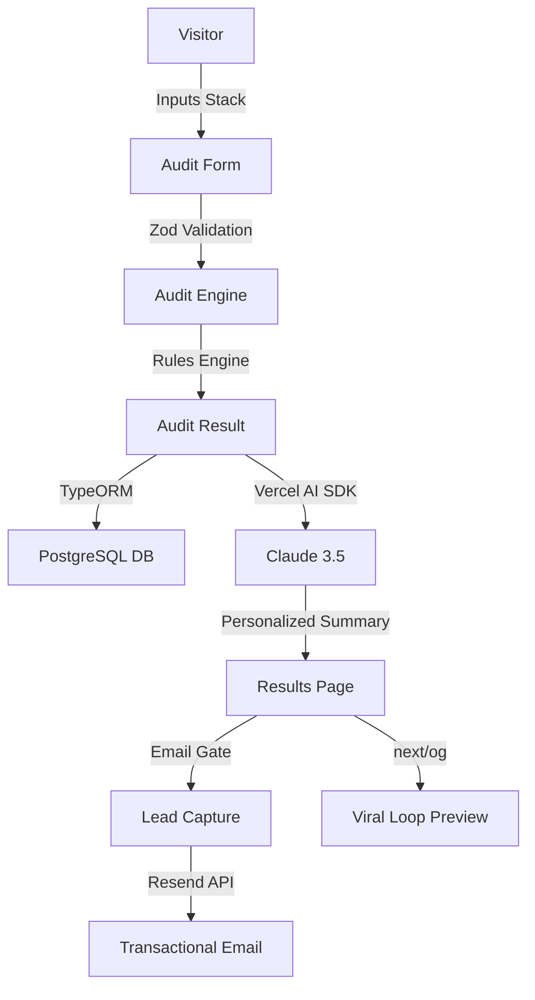

# Architecture & Technical Decisions

## 1. System Overview

## 2. Core Stack
- **Framework**: Next.js 14 (App Router)
- **Styling**: Tailwind CSS & `shadcn/ui`
- **Database**: PostgreSQL (Supabase)
- **ORM**: TypeORM
- **AI Integration**: Vercel AI SDK (Claude)
- **Rate Limiting**: Upstash Redis

## 3. The Deterministic Engine (`src/lib/audit-engine`)
While the app uses AI for summarization, the core auditing logic is *purely deterministic*. We do not rely on LLMs to calculate savings or identify overlap.
- **Why?**: LLMs hallucinate numbers. When dealing with a company's financial spend, the data must be 100% accurate and reproducible.
- **Implementation**: A pure function pipeline (`engine.ts`) takes user inputs and runs them against specific rules (`rules.ts`) using static `pricing.ts` constants.

## 4. Scalability: Handling 10k+ Audits/Day
If this were to scale to 10k audits/day, I would make the following changes:
1. **Edge Functions**: Move the audit engine and results rendering to the edge to reduce TTFB.
2. **Caching**: Implement aggressive caching of tool pricing in Redis to avoid DB hits.
3. **Queueing**: Move the LLM summary generation to a background worker (e.g., Inngest or BullMQ) to prevent API timeouts during high traffic.
4. **Read Replicas**: Introduce PostgreSQL read replicas for the results page, as the workload is 95% read-heavy.

