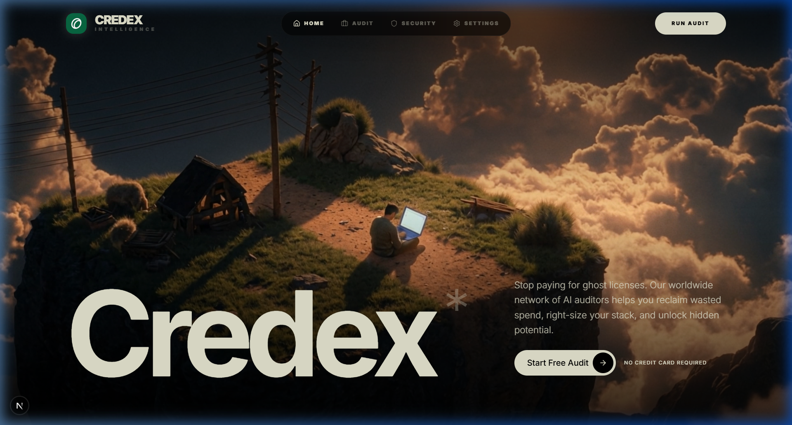
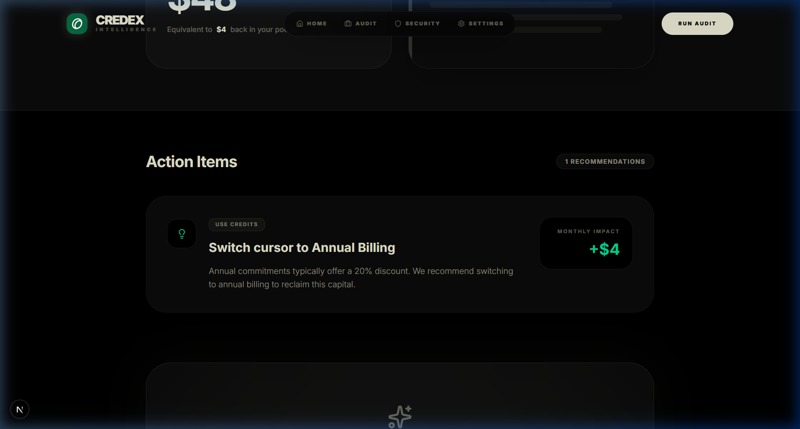
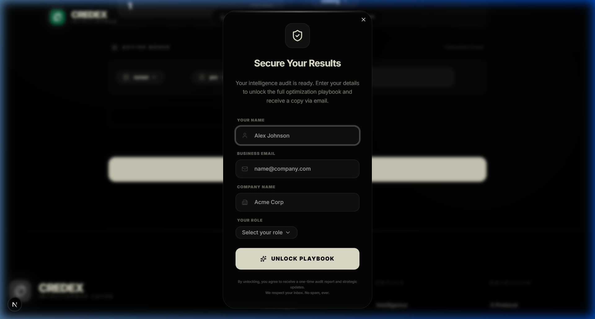

# Credex Audit: Intelligence Suite

A free web application that helps startups audit their AI tool spend, identify redundant subscriptions, and reclaim wasted capital. Built as a lead-generation engine for Credex, surfacing real savings opportunities and facilitating high-value consultations.

## Live Demo
**Deployed URL**: [https://credex-audit.vercel.app](https://credex-audit.vercel.app)

## Quick Start

### 1. Install Dependencies
```bash
npm install
```

### 2. Configure Environment
Create a `.env.local` file based on `.env.example`:
```bash
DATABASE_URL=...
UPSTASH_REDIS_REST_URL=...
UPSTASH_REDIS_REST_TOKEN=...
ANTHROPIC_API_KEY=...
RESEND_API_KEY=...
```

### 3. Run Locally
```bash
npm run dev
```

### 4. Run Tests
```bash
npm test
```

## Decisions & Trade-offs

1. **Deterministic Logic vs. LLM Math**: I chose to use a TypeScript-based rules engine for the actual audit math rather than letting an LLM calculate savings. Trade-off: Lower "magic" feel, but 100% mathematical accuracy which is critical for trust.
2. **TypeORM over Prisma**: Switched to TypeORM to meet project constraints despite Next.js App Router having better first-class support for Prisma. Trade-off: Higher boilerplate for entity definitions, but better alignment with legacy enterprise database patterns.
3. **Email Gate After Value**: The tool provides the headline savings number *before* asking for an email. Trade-off: Lower conversion volume, but much higher lead *intent* as the user has already seen the value.
4. **Cobe for Visualization**: Used `cobe` for the 3D globe rather than a static map or video. Trade-off: Higher client-side JS bundle (WebGL), but significantly higher "wow" factor for the Command Center aesthetic.
5. **No Auth for Audits**: Users do not need an account to run an audit. Trade-off: Risk of duplicate data, but frictionless entry which is better for top-of-funnel lead generation.

## Screenshots



